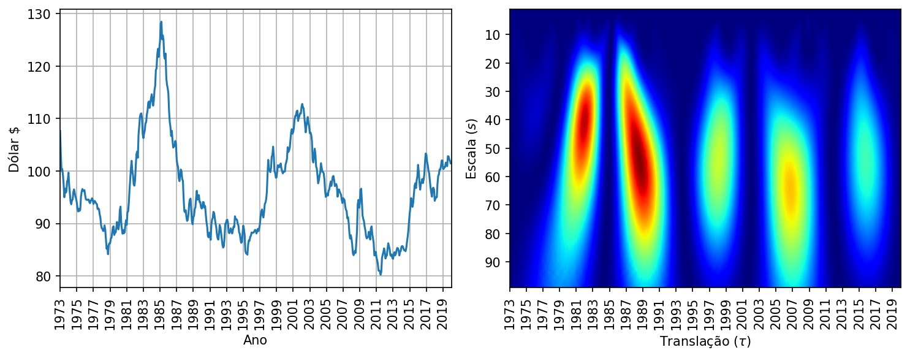

<h1>Escalograma para análise de Séries Temporais</h1>
<h2>Transformada Waveletel Contínua</h2>

Neste projeto aprenderemos como implementar o Escalograma da Transformada Wavelet Contínua e como utilizar esta ferramenta para análise de sinais (séries temporais). Veremos exemplos com sinais Doppler, Eletrocardiograma (ECG) e série histórica do dólar.

<b>Acesse o link: https://youtu.be/_zc6bTisbcM para assistir ao video-tutorial.</b>  
 

